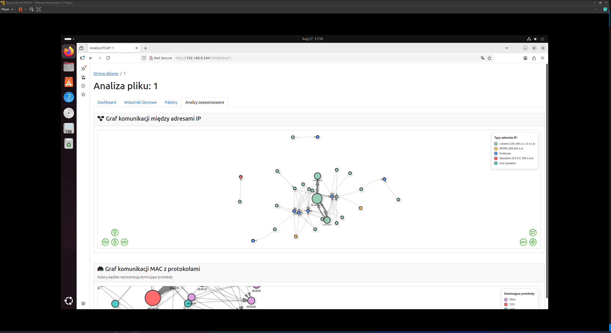
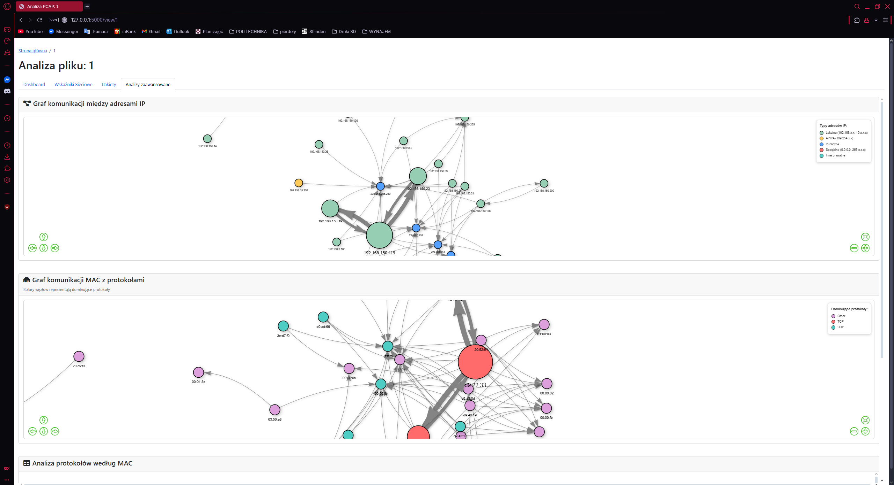

# Wizualizer Ruchu Sieciowego

*Network Traffic Visualizer* - narzędzie do analizy i wizualizacji plików PCAP z zaawansowanymi funkcjami raportowania.


*Główny interfejs aplikacji*

## Spis treści

1. [Opis projektu](#opis-projektu)
2. [Właściwości i funkcjonalności](#właściwości-i-funkcjonalności)
3. [Wymagania systemowe](#wymagania-systemowe)
4. [Instrukcja instalacji](#instrukcja-instalacji)
5. [Instrukcja uruchomienia](#instrukcja-uruchomienia)
6. [Scenariusze użytkowania](#scenariusze-użytkowania)
7. [Interfejs użytkownika](#interfejs-użytkownika)
8. [Struktura projektu](#struktura-projektu)
9. [Testowanie](#testowanie)
10. [Autorzy](#autorzy)
11. [Wykorzystane biblioteki](#wykorzystywane-biblioteki)

---

## Opis projektu

**Wizualizer Ruchu Sieciowego** to aplikacja webowa stworzona w ramach projektu PSC-F na Politechnice Śląskiej. Narzędzie umożliwia kompleksową analizę ruchu sieciowego z plików PCAP poprzez:

- **Wizualizację interaktywną** - wykresy, grafy sieciowe i mapy komunikacji
- **Analizę statystyczną** - głęboka analiza protokołów, portów i adresów
- **Zaawansowane raportowanie** - generowanie raportów PDF z możliwością filtrowania
- **Eksport danych** - eksport do CSV z zaawansowanym filtrowaniem


*Dashboard z wykresami statystycznymi*

---

## Właściwości i funkcjonalności

### Podstawowe funkcje
-  **Analiza plików PCAP/PCAPNG/CAP** - obsługa wszystkich popularnych formatów
-  **Interaktywne wykresy** - wykresy kołowe, słupkowe, liniowe i histogramy
-  **Grafy sieciowe** - wizualizacja komunikacji między hostami i adresami MAC
-  **Tabela pakietów** - przeszukiwalna i sortowalna tabela wszystkich pakietów
-  **Eksport JSON/CSV** - możliwość eksportu wyników analizy

###  Zaawansowane analizy
-  **Wskaźniki wydajności sieciowej**:
    - Analiza payload vs overhead
    - Throughput w czasie
    - Efektywność sieci
    - Statystyki payload według protokołów
-  **Analiza komunikacji MAC**:
    - Graf z kolorowanymi protokołami
    - Identyfikacja producentów urządzeń
    - Analiza dominujących protokołów dla każdego MAC
-  **Metryki czasowe**:
    - Rozkład pakietów w czasie
    - Analiza peak throughput
    - Histogram wielkości pakietów

### System filtrowania
- **Filtrowanie wielokryterialne**:
  - Adresy MAC (źródłowe/docelowe)
  - Adresy IP (źródłowe/docelowe) 
  - Protokoły (TCP/UDP/ICMP/inne)
  - Porty (źródłowe lub docelowe)
  - Wielkość pakietów (min/max)
  - Zakres czasowy
- **Raportowanie z filtrami**:
  - Generowanie raportów PDF tylko dla wyfiltrowanych pakietów
  - Eksport CSV z zastosowanymi filtrami
  - Podgląd statystyk dla przefiltrowanych danych

### System raportowania
- **Konfigurowalne raporty PDF**:
  - Wybór elementów do uwzględnienia
  - Wysokiej jakości wykresy (300 DPI)
  - Profesjonalne formatowanie
  - Automatyczne numerowanie stron
- **Szablony raportów**:
  - Raport podstawowy (protokoły, porty, MAC)
  - Raport zaawansowany (wskaźniki sieciowe, throughput)
  - Raport filtrowany (tylko wybrane pakiety)


*Przykład wygenerowanego raportu PDF*

---

## Wymagania systemowe

### Python i biblioteki
```
Python 3.7+
Flask 2.0+
Scapy 2.4+
Pandas 1.3+
Matplotlib 3.5+
ReportLab 3.6+
NetworkX 2.6+
NumPy 1.21+
```

### System operacyjny (testowane w przeglądarkach na systemach)
-  Windows 10/11
-  Ubuntu 24.04
-  Android 13

---

## Instrukcja instalacji

### Krok 1: Pobranie aplikacji
wypakuj folder Wizualizer-ruchu-sieciowego
```bash
cd Wizualizer-ruchu-sieciowego
```
lub

### Krok 2: Instalacja zależności
```bash
pip install -r requirements.txt
```

---

## Instrukcja uruchomienia

### Uruchomienie standardowe

1. **Uruchomienie aplikacji**:
   ```bash
   python main.py
   ```

2. **Otwórz przeglądarkę** i przejdź do:
   ```
   http://localhost:5000
   ```
   lub
   ```
   http://<adres ip serwera/komputera>:5000
   ```


*Aplikacja uruchomiona w konsoli*

---

## Potwierdzenie uniwersalności


*Aplikacja na telefonie z androidem*


*Aplikacja na telefonie z androidem*


*Aplikacja na wirtualnej maszynie z ubuntu*


*Aplikacja na wirtualnej maszynie z ubuntu*

## Scenariusze użytkowania

### Scenariusz 1: Analiza podstawowa pliku PCAP


*Interfejs przesyłania pliku PCAP*

**Cele**: Szybka analiza pliku PCAP, identyfikacja głównych protokołów i hostów

**Kroki**:
1. Przejdź na stronę główną aplikacji
2. Wybierz plik PCAP przy użyciu przycisku "Wybierz plik"
3. Kliknij "Wgraj i analizuj"
4. Przejrzyj dashboard z podstawowymi statystykami
5. Sprawdź wykresy protokołów, portów i adresów MAC

**Oczekiwane rezultaty**:
- Przegląd wszystkich protokołów w ruchu
- Identyfikacja najaktywniejszych hostów
- Rozkład wielkości pakietów
- Czasowy rozkład ruchu

### Scenariusz 2: Zaawansowana analiza wydajności sieci


*Zakładka z zaawansowanymi wskaźnikami sieciowymi*

**Cele**: Ocena efektywności sieci, analiza throughput i payload

**Kroki**:
1. Po analizie pliku PCAP przejdź do zakładki "Wskaźniki Sieciowe"  
2. Przeanalizuj wskaźniki KPI (payload, throughput, efektywność)
3. Sprawdź wykresy:
   - Statystyki payload
   - Throughput w czasie
   - Payload według protokołów  
   - Efektywność sieci (payload vs overhead)
4. Przeanalizuj szczegółowe tabele z metrykami

**Oczekiwane rezultaty**:
- Ocena efektywności wykorzystania pasma
- Identyfikacja okresów szczytowego obciążenia
- Analiza overhead protokołów
- Rekomendacje optymalizacji

### Scenariusz 3: Analiza komunikacji urządzeń


*Graf komunikacji między adresami IP oraz MAC*

**Cele**: Zrozumienie topologii sieci i komunikacji między urządzeniami

**Kroki**:
1. Przejdź do zakładki "Analizy zaawansowane"
2. Przeanalizuj grafy komunikacji
3. Sprawdź tabelę "Analiza protokołów według MAC"

**Oczekiwane rezultaty**:
- Mapa komunikacji w sieci lokalnej
- Identyfikacja urządzeń i ich ról
- Analiza dominujących protokołów dla każdego urządzenia
- Wykrycie nietypowych wzorców komunikacji

### Scenariusz 4: Filtrowanie i raportowanie celowane


*Zaawansowany system filtrowania pakietów*

**Cele**: Analiza konkretnego typu ruchu, generowanie celowanych raportów

**Kroki filtrowania**:
1. Przejdź do zakładki "Pakiety"
2. Ustaw filtry zgodnie z potrzebami:
   - **MAC Źródłowe/Docelowe**: np. `28:63:36:bd:bc:46`
   - **IP Źródłowe/Docelowe**: np. `192.168.1.1`
   - **Protokół**: wybierz TCP/UDP/ICMP
   - **Port**: np. `80` (HTTP) lub `443` (HTTPS)
   - **Wielkość pakietu**: np. min. 1000 bajtów
   - **Zakres czasowy**: ustaw konkretny przedział
3. Kliknij "Zastosuj filtry"
4. Przejrzyj przefiltrowane wyniki w tabeli

**Kroki raportowania**:
1. Po ustawieniu filtrów kliknij "Raport z filtrów"
2. Poczekaj na wygenerowanie raportu PDF
3. Pobierz i przejrzyj raport zawierający tylko przefiltrowane pakiety

**Oczekiwane rezultaty**:
- Fokus na konkretnym typu ruchu
- Raport PDF z tylko interesującymi pakietami
- Eksport CSV z przefiltrowanymi danymi

### Scenariusz 5: Audyt bezpieczeństwa sieci

**Cele**: Identyfikacja podejrzanych wzorców, analiza ruchu bezpieczeństwa

**Kroki**:
1. **Analiza portów**:
   - Sprawdź wykres "Najczęstsze porty"
   - Zidentyfikuj nietypowe porty (wysokie numery, niestandartowe usługi)
   
2. **Analiza protokołów**:
   - W wykresie protokołów sprawdź udział nieznanych protokołów
   - Filtry: ustaw protokół na "Inne" i przeanalizuj pakiety
   
3. **Analiza czasowa**:
   - Sprawdź wykres "Rozkład czasowy" - szukaj nietypowych skoków aktywności
   - Ustaw filtry czasowe na podejrzane okresy
   
4. **Analiza wielkości pakietów**:
   - Sprawdź histogram wielkości - szukaj nietypowych rozmiarów
   - Filtry: ustaw bardzo duże (>1400 bajtów) lub bardzo małe (<64 bajty) pakiety
   
5. **Analiza komunikacji**:
   - Graf IP - szukaj połączeń z zewnętrznymi adresami IP
   - Graf MAC - identyfikuj nieznane urządzenia w sieci

**Oczekiwane rezultaty**:
- Lista podejrzanych adresów IP i portów
- Identyfikacja nietypowych wzorców komunikacji  
- Raport bezpieczeństwa z flagowanymi zdarzeniami

### Scenariusz 6: Optymalizacja wydajności sieci

**Cele**: Identyfikacja wąskich gardeł i możliwości optymalizacji

**Kroki**:
1. **Analiza throughput**:
   - Zakładka "Wskaźniki Sieciowe" → wykres "Throughput w czasie"
   - Zidentyfikuj okresy szczytowego obciążenia
   
2. **Analiza efektywności**:
   - Sprawdź wykres "Efektywność sieci"
   - Im wyższy udział payload, tym lepsza efektywność
   
3. **Analiza protokołów**:
   - Wykres "Payload według protokołów"
   - Zidentyfikuj protokoły generujące najwięcej overhead
   
4. **Analiza urządzeń**:
   - Graf MAC - znajdź urządzenia generujące najwięcej ruchu
   - Tabela "Analiza protokołów według MAC"
   
5. **Filtry optymalizacyjne**:
   - Filtruj pakiety o długości <64 bajty (potencjalny overhead)
   - Filtruj protokoły o niskiej efektywności

**Oczekiwane rezultaty**:
- Raport wydajności z kluczowymi metrykami
- Lista rekomendacji optymalizacji
- Identyfikacja urządzeń wymagających uwagi

---

## Interfejs użytkownika

### Strona główna

*Przegląd strony głównej z listą przeanalizowanych plików*

**Główne elementy**:
- Formularz przesyłania plików PCAP
- Pole do wprowadzania ścieżki do pliku
- Lista wcześniej przeanalizowanych plików
- Informacje o projekcie i funkcjach

### Dashboard analizy

*Pełny widok dashboard z wszystkimi wykresami 1*

**Zakładki i komponenty**:

1. **Dashboard** - główne wykresy i statystyki
2. **Wskaźniki Sieciowe** - zaawansowane metryki wydajności  
3. **Pakiety** - tabela z systemem filtrowania
4. **Analizy zaawansowane** - grafy sieciowe i komunikacji

### Tabela pakietów z filtrami

*Interaktywna tabela pakietów z zaawansowanymi filtrami*

### Grafy sieciowe

*Graf komunikacji między adresami IP oraz MAC*

### Modalne okno generowania raportów

*Interfejs konfiguracji raportu PDF 1*


*Interfejs konfiguracji raportu PDF 2*


*Interfejs konfiguracji raportu PDF 3*

---

## Struktura projektu

```
Wizualizer-ruchu-sieciowego/
├── app.py                     # Główny plik aplikacji Flask
├── config.py                  # Plik konfiguracyjny
├── database.py                # Plik menedżera bazodanowego SQLite
├── mac_vendors.py             # Plik kodów MAC producentów (niedziała)
├── packet_analyzer.py         # Analizator pakietów
├── report_generator.py        # Generator raportów
├── stats_generator.py         # Generator statystyk
├── requirements.txt           # Zależności Python
├── README.md                  # Ten plik
├── analyses.db                # Plik bazodanowy
├── .gitignore                 
│
├── templates/                 # Szablony HTML
│   ├── index.html             # Strona główna
│   ├── view.html              # Dashboard analizy  
│   ├── 404.html               # Strona błędu 404
│   └── 500.html               # Strona błędu 500
│
├── static/                    
│   ├── js/
│   │   └── script.js          # JavaScript aplikacji
│   └── img/                   # Obrazy (automatycznie generowane)
│
├── uploads/                   # tworzone raporty (tworzone automatycznie)
│
└── screenshots/               # Zrzuty ekranu dla dokumentacji
    ├── main_page.png
    ├── dashboard.png
    ├── network_metrics.png
    └── ...
```

## Testowanie / uruchomienie

W bazie danych (pliku analyses.db) znajdują się 3 pliki test1, test2 oraz dostarczony przez prowadzącego PCS-F plik z urządzeń uczelnianych do przetestowania programu.

Ze względu na brak możliwości wgrania dużych plików, podsyłam link do folderu na google drive z plikami i bazą danych:
https://drive.google.com/drive/folders/1PjaXMWjwkNHagNvcIWizJtVlrJr3DP6u?usp=sharing

## Autorzy

**Projekt UMPAnUMiW - Semestr 6**
Politechnika Śląska - Wydział Automatyki, Elektroniki i Informatyki

- **Grzegorz Urbański** - Backend, analiza PCAP, generowanie raportów, grafy sieciowe
- **Kamil Adamek** - Frontend, wizualizacje, interfejs użytkownika

## Wykorzystywane biblioteki:
- Flask (BSD License)
- Scapy (GPL v2)
- Chart.js (MIT License)
- Vis.js (MIT License)
- Bootstrap (MIT License)
- DataTables (MIT License)
- numpy (BSD 3-Clause License)
- sqlite3 (Public Domain)
